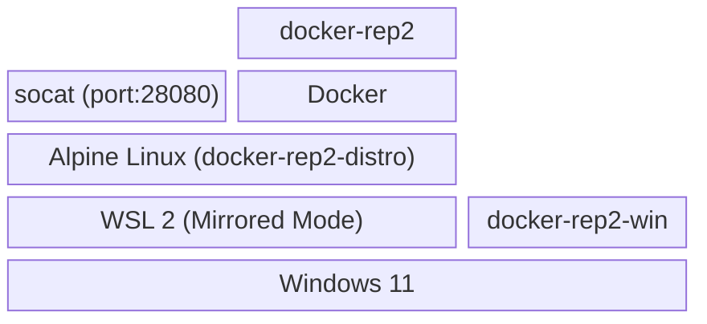
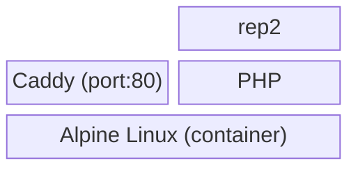

# docker-rep2-win

サーバーサイド 5ch ブラウザ（いわゆる専ブラ）の rep2 を Windows 環境で簡単にセットアップ・運用するためのデスクトップ GUI ランチャー / インストーラーです。

## 概要

`docker-rep2-win` は、[rep2](https://github.com/fukumen/p2-php) を Docker コンテナ化した [docker-rep2](https://github.com/fukumen/docker-rep2) を、Windows アプリケーションとして直感的に管理できるように設計されています。複雑なコマンド操作なしで、インストール、設定変更、起動・停止、アップデートを行うことができます。

Linux 何それ？ WSL 何それ？ Docker 何それ？ だけど rep2 を使いたい人向けのソフトウェアです。GUI で一通りのことはできますが、rep2 に接続するための WEB ブラウザは内蔵していません。PC やスマホの好きなブラウザを使用してください。

## スクリーンショット

| インストール開始 | おまかせインストール | 上級者向けインストール1 |
| :---: | :---: | :---: |
|  |  |  |

| 上級者向けインストール2 | メニュー画面 | 設定画面 |
| :---: | :---: | :---: |
|  |  |  |

## 主な機能

- **ウィザード形式の簡単インストール**: おまかせインストールならインストールフォルダとデータフォルダের指定のみ
- **システム要件の自動判定**: WSL や 仮想化機能（Virtual Machine Platform）のセットアップが不足しているとインストーラーが誘導や警告をします
- **WSL / Docker 連携**: WSL 上の Docker コンテナを自動制御。サインイン時の自動起動も設定可能
- **ファイアウォール設定**: LAN 上の他 PC から rep2 へアクセス出来るように設定可能
- **タスクバーアイコン表示**: WSL の起動状態を表示
- **簡単アップデート**: 新しいバージョンのチェックと更新を GUI から実行（docker-rep2-win自身は未実装）

## システム要件

- **OS**: **Windows 11 (22H2 以降)**  
  ※ WSL2 のネットワーク機能（Mirror Mode など）を利用するため、Windows 11 が必須です。
- **WSL2**: **Mirror Mode**  
  ※ WSL の Mirror Mode を使用するため、他の WSL ディストリビューションを NAT Mode で使用中の場合、 Mirror Mode に変更する必要がありネットワーク設定に影響があります。
- **CPU**: **仮想化支援機能**  
  ※ Intel の VT-x や AMD の SVM などの機能が必要です。BIOS/UEFI で有効にしてください。

インストールフォルダやデータフォルダとは別に WSL ディストリビューション用に `%LOCALAPPDATA%\docker-rep2-win\wsl\ext4.vhdx` に 約800MB 使用します。
具体的には Alpine Linux をベースに docker などをインストールしたディストリビューション名 `docker-rep2-distro` をセットアップし使用しています。

## 使い方

1. [Releases](https://github.com/fukumen/docker-rep2-win/releases) から最新の `docker-rep2-win-setup-x.y.z-win-x64.exe` をダウンロードします。
2. インストーラーを実行し、画面の指示に従ってセットアップを完了させます。
3. デスクトップまたはスタートメニューから `docker-rep2-win` を起動します。

おまかせセットアップしていて `docker-rep2-win` のステータスが起動中なら LAN 上の PC やスマホのブラウザから http://IPアドレス/ で rep2 へアクセス出来ます。

## アンインストール

Windows の「設定 > アプリ > インストールされているアプリ」からアンインストール出来ます。

## 困ったとき

5ch の rep2 スレを確認して同じ内容が無さそうなら相談してください。

不具合は [Issues](https://github.com/fukumen/docker-rep2-win/issues) へ登録してもらえると助かります。

例外発生の場合、インストール時に設定したデータフォルダ（デフォルト：マイドキュメントの rep2-data）の win/win-error.txt に例外の内容が保存されるので情報を添付してください。

rep2 のログはターミナルから `docker compose logs -f` とすれば確認できます。

## 依存関係

- .NET 10.0 SDK
- Windows SDK (10.0.22621.0 以降)
- WSL 2.5.4 (バックグラウンドで実行し続ける場合)
- Alpine Linux

## 制約事項

- WSL モニタ（メイン画面のステータス表示やタスクトレイのアイコン反転表示）は WSL ディストリビューションの死活監視のみで Docker コンテナを監視しているわけではありません
- 「ブラウザを自動起動する」による早いタイミングでの rep2 へのアクセスは待たされたりタイムアウトしたりする場合があります
- はじめて WSL をインストールした場合、[WSL へようこそ](https://github.com/user-attachments/assets/0998a3b2-7a3c-40e6-82f8-cc3353ebb73c)みたいなのが表示される（無視して閉じて大丈夫です）
- rep2 へのアクセスはIPv4のみ
- rep2 と docker-rep2 は fukumen 版の latest を決め打ちしている

## ソフトウェアスタック

### docker-rep2-win

### docker-rep2

## ライセンス

[MIT License](LICENSE)
